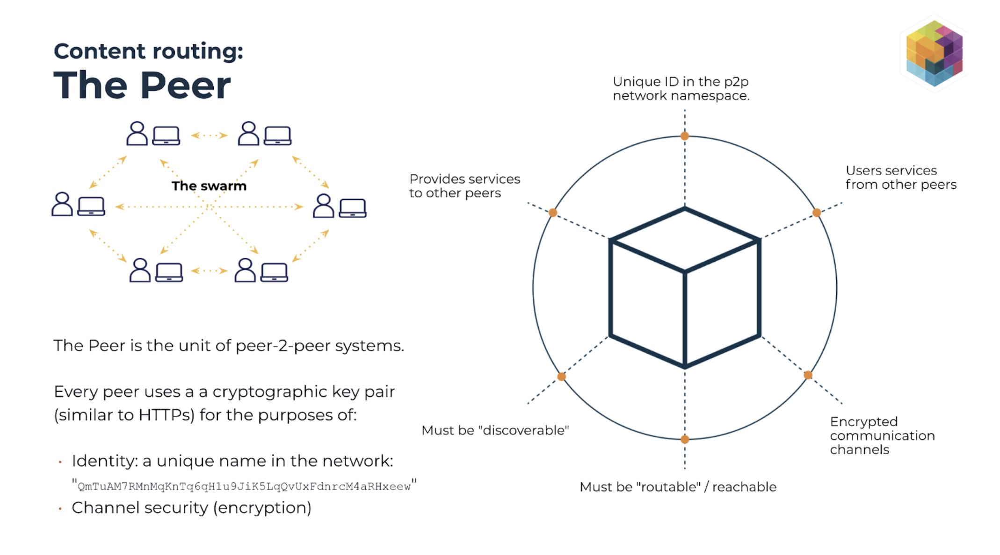
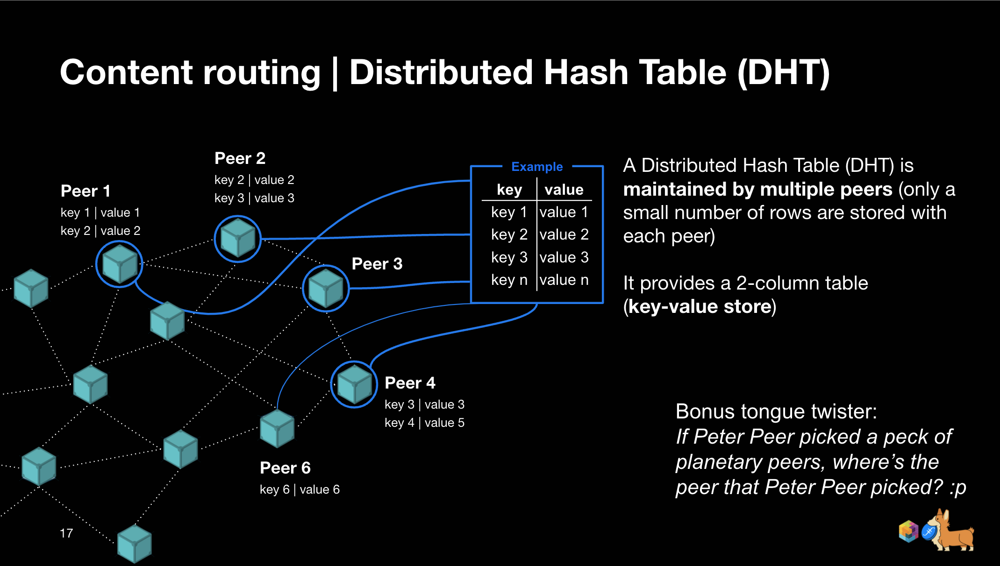

The public distributed hash table is the record of content that is used, along with Kademlia, to discover content-addressed data in a peer-to-peer network. The DHT is the mechanism that allows a peer-to-peer network to work without the old [client-server model](https://en.wikipedia.org/wiki/Client%E2%80%93server_model) that the web2 internet runs on.

### Nodes, Peers, and the Swarm

A **[Peer](https://docs.ipfs.io/concepts/glossary/#peer)** is any connected node on IPFS that relays and/or stores information on the network. You can either search peers using the DHT and Kademlia, or be directly connected to a peer. The set of peers that you (as a peer) are connected to directly is called a **[Swarm](https://docs.ipfs.io/concepts/glossary/#swarm)**.

**[IPFS Nodes](https://docs.ipfs.io/concepts/nodes/)** are programs that run on a computer that can exchange data with other IPFS nodes. **[Bootstrap nodes](https://docs.ipfs.io/concepts/nodes/#bootstrap)** are used when a new node initially enters the IPFS network.

### What does the DHT do for IPFS?
The [DHT is a distributed system](https://medium.com/coinmonks/a-brief-overview-of-kademlia-and-its-use-in-various-decentralized-platforms-da08a7f72b8f) for mapping keys to values. In IPFS, the DHT is used as the fundamental component of the content routing system. It maps what the user is looking for (a CID) to the peer that is actually storing the matching content. There are 3 types of key-value pairings that are mapped using the DHT:

* Provider Records – These map a data identifier (i.e., a multihash) to a peer that has advertised that they have, and are willing, to provide you with that content. This is used by IPFS to find content, and IPNS to find pubsub peers

* IPNS Records – These map an IPNS key (i.e., hash of a public key) to an IPNS record (i.e., a signed and versioned pointer to some path like `/ipfs/bafyXYZ`)

* Peer Records – These map a peerID to a set of multiaddresses at which the peer may be reached. This is used by IPFS when we know of a peer with content, but do not know its address, and used for manual connections

[Read More in the docs](https://docs.ipfs.io/concepts/dht)

## Kademlia

[Kademlia](https://en.wikipedia.org/wiki/Kademlia) is a distributed hash table for decentralized peer-to-peer computer networks designed by Petar Maymounkov and David Mazières in 2002. It specifies the structure of the network and the exchange of information through node lookups.

Kademlia makes it easier and quicker to find peers with content by, essentially, comparing how similar two nodes' content is and rank it by how similar or 'close' it is. [Read the paper](https://pdos.csail.mit.edu/~petar/papers/maymounkov-kademlia-lncs.pdf) to learn about Kademlia more in-depth.

## Bitswap
Along with Kademlia and the DHT, [Bitswap](https://docs.ipfs.io/concepts/bitswap/#bitswap) is a message-based protocol that enables peers to exchange data. Bitswap enables a peer to create a want-list of content, then query connected peers (and the peers they are connected to) for that information.

#### The Public DHT | LabWeek 2021 <!-- Who Presented?  -->
<!-- Add a context paragraph-- The DHT keeps the IPFS Network of Peers Connected... -->



Learn more in [this presentation](https://docs.google.com/presentation/d/e/2PACX-1vRFnTRDresIb6g-mAv2dLxrYpUmbtfQFsX48OVxOzgiVs7JN6bBD7LDz0n36_rIUPb7W_I4t5l1gvTJ/pub?start=false&loop=true&delayms=3000)

<!-- Link to public copy of Slides: https://docs.google.com/presentation/d/1NJMonh2YolwKSpwEt61lU2YdvUswDAFhErn4RJwCVh0/edit#slide=id.p -->

<!--
### Radar
### Filestore
 Add a paragraph  -->